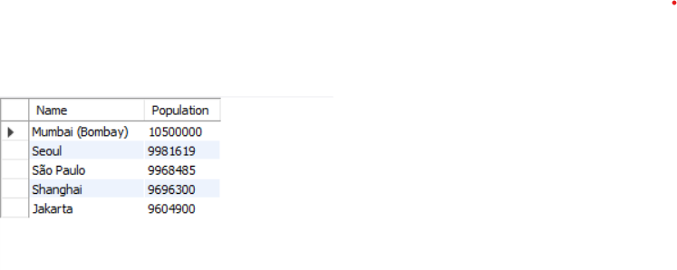
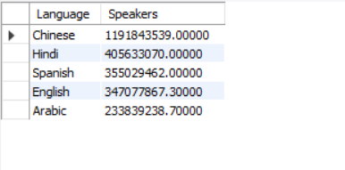
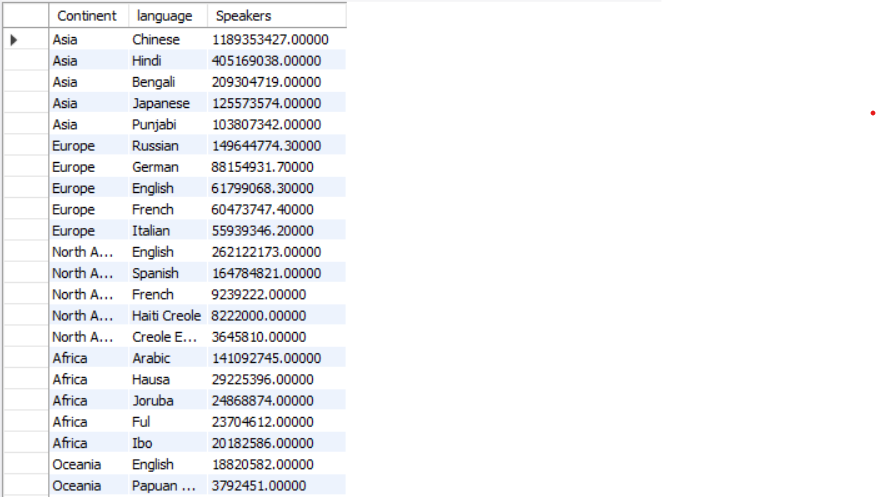
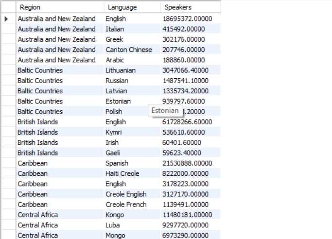
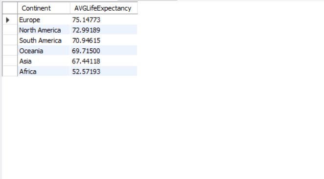
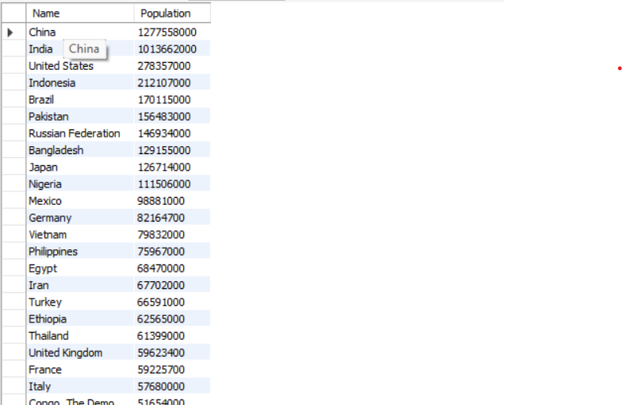
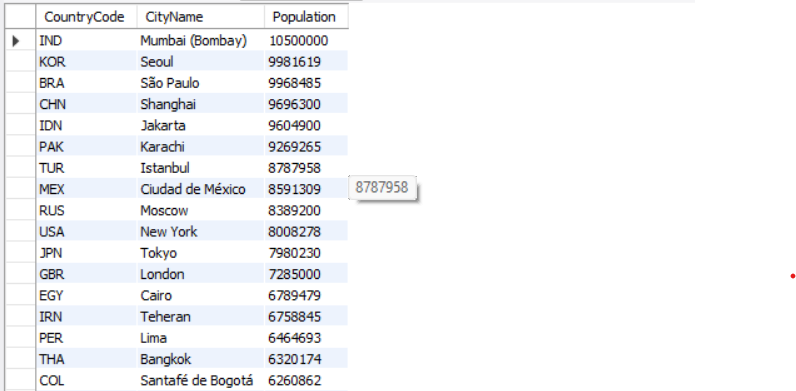

# SQL Portfolio – Kathryn Starkey
## World Dataset

The World dataset is a classic relational database containing information about countries, cities, languages, populations, and life expectancy. In this project, I use SQL to explore demographic and geographic questions such as the most spoken languages, life expectancy across continents, and the largest cities by population. These queries highlight skills in filtering, aggregation, subqueries, and window functions—essential techniques for extracting insights from structured data. This project also demonstrates how SQL can answer business-style questions from raw data, a key responsibility in data support and analytics roles.


For each example, you’ll see:  
- **The business-style question/problem**  
- **The SQL query I wrote**  
- **A screenshot of the result** 
--- 

## 1. Basic Filtering and Sorting

**Question:**  What are the top 5 most populous countries?
``` sql
SELECT Name, Population
FROM country
ORDER BY Population DESC
LIMIT 5;
```

**Result Screenshot:**


**Question:**  What are the top 5 most populous cities?
``` sql
SELECT Name, Population
FROM city
ORDER BY Population DESC
LIMIT 5;
```

**Result Screenshot:**


**Question:** What are the top 5 spoken languages?
``` sql
SELECT Language, SUM(Population * Percentage / 100) AS Speakers
FROM countrylanguage cl
JOIN country c ON cl.CountryCode = c.Code
GROUP BY Language
ORDER BY Speakers DESC
LIMIT 5;
```

**Result Screenshot:**


## 2. Window Functions (ROW_NUMBER) with Joins & Aggregation

**Question:**  What are the top 5 Languages per continent?
``` sql
WITH language_counts AS (
	SELECT 
		c.Continent,
        cl.language,
        SUM(C.Population * cl.Percentage/100) AS Speakers
        FROM countrylanguage cl
        JOIN country c ON cl.CountryCode = c.Code 
        GROUP BY c.Continent, cl.Language
        )
SELECT Continent, language, Speakers
FROM(
	SELECT 
		Continent, Language, Speakers,
        ROW_NUMBER() OVER (PARTITION BY Continent ORDER BY Speakers DESC) AS rn
	FROM language_counts
)ranked
WHERE rn <= 5
ORDER BY Continent, rn;
```

**Result Screenshot:**


**Question:** What are the top 5 Languages per region?
``` sql
WITH language_counts AS (
	SELECT
		c.Region,
        cl.Language,
        SUM(c.Population * cl.Percentage/100) AS Speakers
	FROM countrylanguage cl
    JOIN country c ON cl.CountryCode = c.Code
    GROUP BY c.Region, cl.Language
)
SELECT Region, Language, Speakers
FROM (
	SELECT
		Region, Language, Speakers,
        ROW_NUMBER() OVER (PARTITION BY Region ORDER BY Speakers DESC) AS rn
	FROM language_counts
)ranked
WHERE rn <= 5
ORDER BY Region, rn;
```

**Result Screenshot:**


## 3. Simple Aggregation

**Question:** What is the average life expectancy by continent?
``` sql
SELECT Continent, AVG(LifeExpectancy) AS AVGLifeExpectancy
FROM country
WHERE LifeExpectancy IS NOT NULL
GROUP BY Continent
ORDER BY AvgLifeExpectancy DESC;
```

**Result Screenshot:**


## 4. Using Subqueries in WHERE

**Question:** List the countries with a population greater than the average population.
``` sql
SELECT Name, Population
FROM country
WHERE Population > (
	SELECT AVG(Population) FROM country
)
ORDER BY Population DESC;
```

**Result Screenshot:**


## 5. Classic Window Function with ROW_NUMBER

**Question:** Find the city with the largest population in each country.
``` sql
SELECT CountryCode, Name AS CityName, Population
FROM (
	SELECT 	
		CountryCode, Name, Population,
        ROW_NUMBER() OVER (PARTITION BY CountryCode ORDER BY Population DESC) AS rn
	FROM city
)ranked
WHERE rn = 1
ORDER BY Population DESC;
```

**Result Screenshot:**

